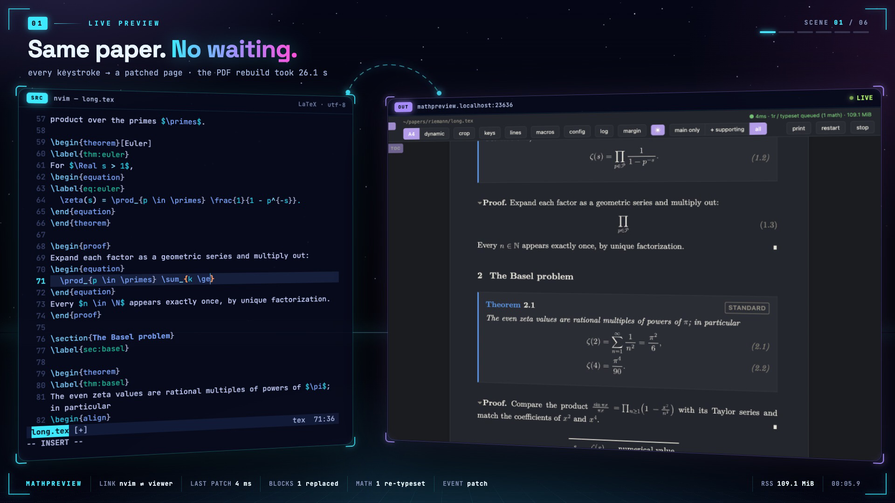
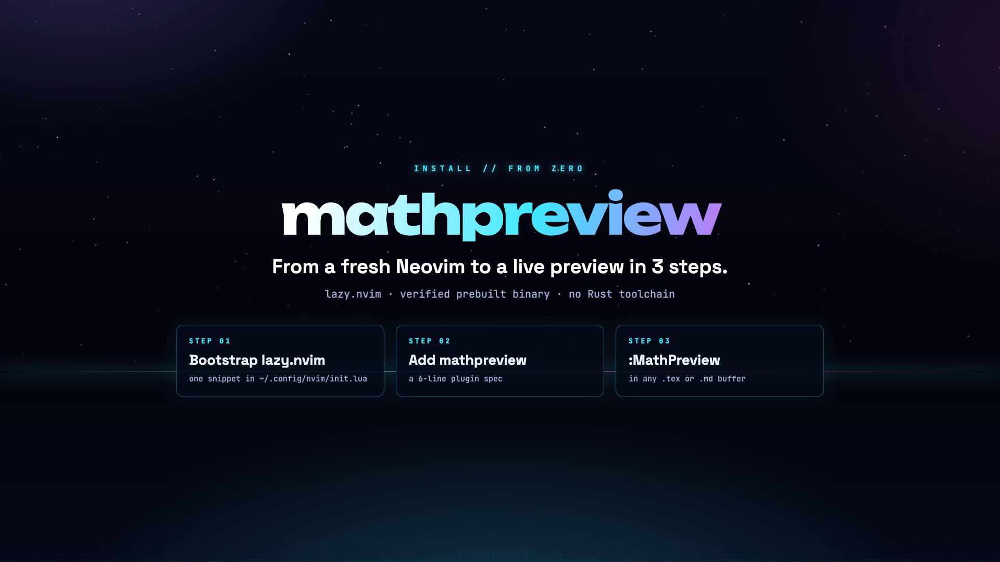

# mathpreview

Live LaTeX and Markdown preview for Neovim. Write in your editor and see the
document update in your browser, without rebuilding a PDF or saving the buffer.

## See it in action

| Introduction · 2:14 | Installation · 1:12 |
| --- | --- |
| [](promo/mathpreview-intro-github.mp4?raw=true) | [](promo/mathpreview-install.mp4?raw=true) |

Click either thumbnail to download the MP4 (about 10 MB each).

## What it does

- Live updates for multi-file LaTeX projects and standalone Markdown documents.
- Two-way source sync, including words, equation rows, visual selections, and
  Neovim search highlights.
- Equation and reference hover previews, source labels, and pinned margin cards.
- Custom macros, theorem numbering, citations, figures, and tables for LaTeX.
- Markdown math, Bookdown/Quarto-style theorems, blurred proofs, and configurable
  custom-block boundaries.
- A4 or responsive layout, themes, Vim-style navigation, and copying equations
  or individual rows as LaTeX.

The live viewer bundles MathJax and fonts. There is no separate MathJax,
Node/npm, or TeX installation for ordinary preview. Optional native TikZ
rendering and LaTeX PDF compilation need a local TeX toolchain.

## Install

Add **one** of these entries to your lazy.nvim plugin spec. Both use the same
viewer. Neovim and `curl` are required.

### Compile locally (default)

Requires a Rust toolchain. The build hook compiles the binary when the plugin
is installed or updated.

```lua
{
  "sonv/TexViewer",
  ft = { "tex", "plaintex", "latex", "markdown" },
  build = "cargo install --path crates/cli --force",
}
```

### Use a GitHub binary (no Rust)

Downloads the release matching the plugin version and verifies its SHA-256
checksum. Available for macOS and GNU/Linux on arm64 and x86_64. Linux binaries
require glibc 2.34 or newer.

```lua
{
  "sonv/TexViewer",
  ft = { "tex", "plaintex", "latex", "markdown" },
  build = "sh scripts/install-prebuilt.sh",
  opts = { install_method = "github" },
  config = function(_, opts)
    require("mathpreview").setup(opts)
  end,
}
```

Do not pair GitHub mode with the Cargo build hook. Either hook is optional:
without it, the plugin installs a missing or stale binary on first use.
GitHub mode needs `sh`, `curl`, `tar`, and `shasum` or `sha256sum`. It does
not fall back to compiling.

For packer.nvim, vim-plug, manual installation, offline assets, and the
standalone CLI, see the [installation guide](docs/installation.md).

## Use

Open a `.tex`, `.md`, or `.markdown` buffer and run:

```vim
:MathPreview
```

The browser opens automatically and follows your edits, including unsaved
changes. Cmd/Ctrl-click rendered text to jump back to its source. Hover a
reference to preview its target, or an equation number to see its source label.
Click an equation or a row, then copy to get its LaTeX source.

| Command | Purpose |
| --- | --- |
| `:MathPreview` | Open or return to the current preview |
| `:MathPreviewStop` | Stop the preview server |
| `:MathPreviewRestart` | Restart, including after a binary update |
| `:MathPreviewStatus` | Check the binary path, versions, and server state |
| `:MathPreviewDebug` | Inspect loaded configuration and macro files |
| `:MathPreviewClean` | Find abandoned preview servers and ask before stopping them |

The toolbar's **config** button controls appearance, hover size, keybindings,
and Markdown settings. Use **macros** for preview-only macro definitions.
See [viewer controls](docs/viewer.md) for navigation, selection, and printing.

## Configure

Plugin options go in `require("mathpreview").setup({...})`, or the `opts`
table in the GitHub-mode example above. See [Neovim setup](docs/neovim.md).

Viewer settings go in the config panel or a TOML file:

- Global: `~/.config/mathpreview/config.toml`, or
  `$XDG_CONFIG_HOME/mathpreview/config.toml`.
- Project: `.mathpreview.toml` beside your project.

For example:

```toml
[viewer]
font-size = 20
hover-preview-scale = 150
```

For custom math commands, use the **macros** panel,
`.mathpreview-macros.tex`, or the global `mathpreview/macros.tex` file.
See [configuration](docs/configuration.md) and [macros](docs/macros.md)
for precedence, examples, and supported definitions.

## Documentation

- [Installation and CLI](docs/installation.md)
- [Viewer controls and keyboard shortcuts](docs/viewer.md)
- [Neovim setup and source-sync troubleshooting](docs/neovim.md)
- [Viewer configuration](docs/configuration.md)
- [LaTeX support](docs/latex.md) and [macro overrides](docs/macros.md)
- [Markdown, theorems, and custom blocks](docs/markdown.md)
- [Converter API](docs/converter-api.md) and [architecture](docs/architecture.md)

For contributors: [development and testing](DEVELOPMENT.md),
[performance](PERFORMANCE.md), [design rationale](DESIGN.md), and
[changelog](CHANGELOG.md).

## Scope

mathpreview is a reading and editing preview, not a TeX engine. Complex package
internals and exact PDF layout may need preview overrides or a real TeX
compile. Markdown is single-file, raw HTML stays inert, and R/knitr/Jinja code
is not executed. Bookdown and Quarto support covers the documented syntax,
not their complete publishing pipelines.

[MIT license](LICENSE).
